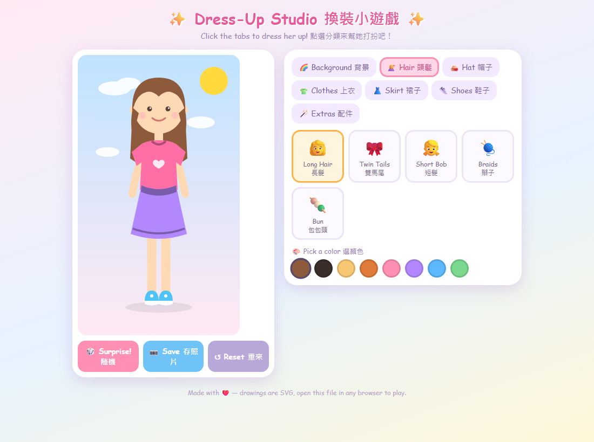

# 🎮 My Games 我們的小遊戲

Little games we build together as a family — simple, colorful, and made with love.
和女兒一起做的小遊戲 — 簡單、繽紛、充滿愛。❤️

## 🕹️ Play Now 馬上玩

No install needed — they run right in your browser (computer, tablet, or phone):

| Game 遊戲 | Play 遊玩連結 | About 介紹 |
|---|---|---|
| ✨ **Dress-Up Studio 換裝小遊戲** | [▶️ Play 開始玩](https://javisofweiyen.github.io/my_games/dress-up-studio/) | Dress up your doll! Hair, hats, clothes, skirts, shoes, accessories — every piece in any color. Featuring an Ice Queen ❄️ outfit. 幫娃娃換裝:髮型、帽子、衣服、裙子、鞋子、配件通通可以換,還有冰雪女王造型! |
| 🧱 **Block Drop 方塊掉掉樂** | [▶️ Play 開始玩](https://javisofweiyen.github.io/my_games/tetris/) | A cute Tetris! Stack the falling blocks and clear full rows. Keyboard or touch/swipe controls, next + hold pieces, levels, and a saved high score. 可愛版俄羅斯方塊:堆方塊、消滿行,支援鍵盤與手機滑動,有預告/暫存方塊、等級與最高分紀錄! |
| 🏎️ **City Racer 城市賽車** | [▶️ Play 開始玩](https://javisofweiyen.github.io/my_games/city-racer/) | A cockpit-view pseudo-3D racer — dashboard with speed + rev gauges and a steering wheel, racing a neon night highway past detailed traffic. Beat the clock to clear each level; it gets faster every time. Keyboard or touch. 車內視角賽車:儀表板有時速錶與轉速錶、還有方向盤,飆過霓虹夜間公路、閃避擬真車流,限時內衝過終點就晉級,每關更快,支援鍵盤與觸控! |



## ✨ Dress-Up Studio Highlights 遊戲特色

- 👗 **7 categories 七大分類** — hair, hat, clothes, skirt, shoes, extras, and backgrounds 髮型、帽子、上衣、裙子、鞋子、配件、背景
- 🎨 **Every piece recolorable 每件都能換色** — pick from a palette for each item 每個單品都有調色盤
- ❄️ **Ice Queen set 冰雪女王套裝** — platinum side braid, ice gown, snow cape, and ice magic 白金髮辮、冰雪長裙、雪花披風、冰雪魔法
- 🎲 **Surprise! 隨機穿搭** — one tap for a random outfit with confetti 一鍵隨機換裝+灑花
- 📷 **Save your look 保存造型** — download your creation as a picture 把作品存成圖片
- 💾 **Auto-save 自動記憶** — your outfit is still there next time 下次打開造型還在

## 🧱 Block Drop Highlights 遊戲特色

- 🎮 **Classic falling blocks 經典掉落方塊** — all 7 shapes in candy-pastel colors 七種粉彩方塊
- ⌨️ **Keyboard & touch 鍵盤與觸控** — arrow keys, or tap and swipe on phones 方向鍵,或手機點按/滑動
- 👀 **Next & Hold 預告與暫存** — plan ahead and stash a piece for later 看下一個、把方塊暫存起來
- 👻 **Ghost piece 落點提示** — see where your block will land 看得到方塊會落在哪
- 🚀 **Levels & speed-up 等級加速** — every 10 lines it gets faster 每 10 行越來越快
- 🏆 **High score 最高分** — your best is remembered 自動記住最高分

## 🏎️ City Racer Highlights 遊戲特色

- 🪟 **Cockpit view 車內視角** — sit in the driver's seat with the dashboard and half the wheel in view 坐在駕駛座,看得到儀表板與半個方向盤
- 🎛️ **Live gauges 即時儀表** — a speedometer and a rev counter with needles, plus a gear readout 時速錶、轉速錶(指針會動)與檔位顯示
- 🚗 **Detailed traffic 擬真車流** — cars and trucks with windows, mirrors and glowing tail lights to overtake 有車窗、後視鏡、發光尾燈的轎車與卡車可超越
- ⏱️ **Timed levels 限時闖關** — reach the finish before time runs out to advance; each level is faster and busier 在時間內衝過終點就晉級,每關更快、車更多
- 🌃 **Neon night city 霓虹夜城** — parallax skyline, moon, glowing rumble strips and roadside lights 視差天際線、月亮、發光路緣與路邊燈
- ⌨️📱 **Keyboard & touch 鍵盤與觸控** — arrows/WASD or on-screen buttons 方向鍵/WASD 或螢幕按鈕

## 🚀 Run Locally 在自己電腦上玩

Everything is a single HTML file — no installs, no build tools:

```
git clone https://github.com/JavisOfWeiYen/my_games.git
```

Then double-click any game's `index.html` (e.g. `dress-up-studio/index.html`
or `tetris/index.html`). That's it!
下載後直接點兩下任一遊戲的 `index.html`(例如 `dress-up-studio/index.html`
或 `tetris/index.html`)就能玩。

## 🛠️ How It's Made 怎麼做的

- Plain **HTML + CSS + JavaScript** — one file per game, easy to read and tinker with 純 HTML/CSS/JS,一個檔案一個遊戲,方便修改
- All art is hand-drawn **SVG** (drawings made of code!) — no image files 所有圖案都是用程式碼畫的 SVG
- Built as a parent–child coding project: each game's own README shows kids how to add their own creations 親子共學專案,每個遊戲的 README 都教小朋友怎麼自己加新內容

Want to add your own clothes to the dress-up game?
See [dress-up-studio/README.md](dress-up-studio/README.md) for a kid-friendly guide.
想自己畫新衣服?看 [dress-up-studio/README.md](dress-up-studio/README.md) 的小朋友教學。

## 📄 License 授權

[MIT](LICENSE) — free to play, copy, learn from, and remix. 歡迎遊玩、學習、改作!
